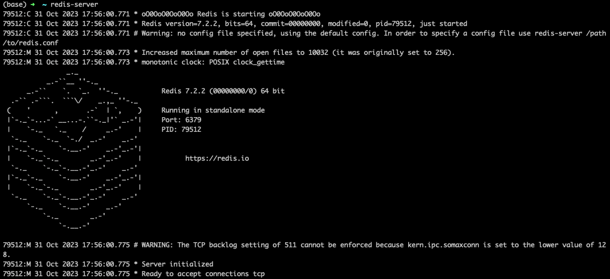
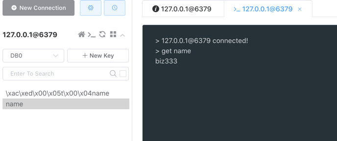

<div align="center">

English | [简体中文](./README-zh_CN.md)

</div>

# Experiment: Base and Module use Redis

## Experiment application

### sample-redis-base
The base is built from regular SpringBoot application. The only change you need to do is to add the following dependencies in pom
```xml
<!-- Add dynamic module related dependencies here -->
<!--    Be sure to put this dependency as the first dependency in the build pom, and set type= pom,
    The principle can be found here https://koupleless.gitee.io/docs/contribution-guidelines/runtime/multi-app-padater/ -->
<dependency>
    <groupId>com.alipay.sofa.koupleless</groupId>
    <artifactId>koupleless-base-starter</artifactId>
    <version>${koupleless.runtime.version}</version>
    <type>pom</type>
</dependency>
<!-- end of dynamic module related dependencies -->

<!-- Add dependencies for deploying multiple web applications in tomcat single host mode here -->
<dependency>
    <groupId>com.alipay.sofa</groupId>
    <artifactId>web-ark-plugin</artifactId>
</dependency>
<!-- end of dependencies for single host deployment -->
```

### sample-redis-biz
The biz is built form regular SpringBoot application. The only change you need to do is to add the following dependencies in pom
```xml
<dependency>
    <groupId>com.alipay.sofa.koupleless</groupId>
    <artifactId>koupleless-app-starter</artifactId>
    <scope>provided</scope>
</dependency>

<!-- change the packaging plugin to sofa-ark biz packaging plugin, packaged as ark biz jar -->
<plugin>
    <groupId>com.alipay.sofa</groupId>
    <artifactId>sofa-ark-maven-plugin</artifactId>
    <version>${sofa.ark.version}</version>
    <executions>
        <execution>
            <id>default-cli</id>
            <goals>
                <goal>repackage</goal>
            </goals>
        </execution>
    </executions>
    <configuration>
        <skipArkExecutable>true</skipArkExecutable>
        <outputDirectory>./target</outputDirectory>
        <bizName>${bizName}</bizName>
        <!-- single host mode, need to change web context path -->
        <webContextPath>${bizName}</webContextPath>
        <declaredMode>true</declaredMode>
    </configuration>
</plugin>
```
Note that here by introducing conf/ark/bootstrap.properties or conf/ark/bootstrap.yml to complete the automatic slimming of the module, including the dependency of ehcache will also be automatically delegated to the base for loading. Also, you need to change the web context path of different biz to different values, so that multiple web applications can be successfully installed in a tomcat host.

## Experiment Steps
### Install Redis locally and start it

1. Download and install from the official website [download](https://redis.io/docs/install/)
2. It can be installed with brew on MacOS (brew install redis). After the installation is complete, execute redis-server to start the Redis service


### Start the base application sample-redis-base

check the pom of base application, you can see that the base application access redis, and different applications will choose different redis clients according to the actual application scenario

#### redis + lettuce
```xml
<!-- redis dependency, spring boot 2.x default lettuce client, so lettuce-core will be introduced as an indirect dependency -->
<dependency>
    <groupId>org.springframework.boot</groupId>
    <artifactId>spring-boot-starter-data-redis</artifactId>
</dependency>
<!-- Cause spring boot 2.x does not enable connection pool by default, you need to import commons-pool2 separately, otherwise an error will be reported when starting -->
<dependency>
    <groupId>org.apache.commons</groupId>
    <artifactId>commons-pool2</artifactId>
</dependency>
```

#### redis + jedis
```xml
<!-- add redis dependency, and exclude lettuce-core which is introduced as an indirect dependency by default -->
<dependency>
    <groupId>org.springframework.boot</groupId>
    <artifactId>spring-boot-starter-data-redis</artifactId>
    <exclusions>
        <exclusion>
            <groupId>io.lettuce</groupId>
            <artifactId>lettuce-core</artifactId>
        </exclusion>
    </exclusions>
</dependency>
<!-- add jedis dependency -->
<dependency>
    <groupId>redis.clients</groupId>
    <artifactId>jedis</artifactId>
</dependency>
```

Using IDEA run to start the base application

### Packaging module application sample-redis-biz

add redis dependency for module application just like base application, the only difference is that you need to set scope=provided for redis, lettuce, jedis dependencies to ensure that the relevant dependency classes are loaded by the base

#### redis + lettuce
```xml
<!-- add redis dependency, spring boot 2.x default lettuce client, so lettuce-core will be introduced as an indirect dependency -->
<dependency>
    <groupId>org.springframework.boot</groupId>
    <artifactId>spring-boot-starter-data-redis</artifactId>
    <scope>provided</scope>
</dependency>
<!-- Cause spring boot 2.x does not enable connection pool by default, you need to import commons-pool2 separately, otherwise an error will be reported when starting -->
<dependency>
    <groupId>org.apache.commons</groupId>
    <artifactId>commons-pool2</artifactId>
    <scope>provided</scope>
</dependency>
```

#### redis + jedis
```xml
<!-- add redis dependency, and exclude lettuce-core which is introduced as an indirect dependency by default -->
<dependency>
    <groupId>org.springframework.boot</groupId>
    <artifactId>spring-boot-starter-data-redis</artifactId>
    <scope>provided</scope>
    <exclusions>
        <exclusion>
            <groupId>io.lettuce</groupId>
            <artifactId>lettuce-core</artifactId>
        </exclusion>
    </exclusions>
</dependency>
<!-- add jedis dependency -->
<dependency>
    <groupId>redis.clients</groupId>
    <artifactId>jedis</artifactId>
    <scope>provided</scope>
</dependency>
```

Take redis + jedis as an example to show the use of redis in the module. Add redis + jedis configuration to the module application, and add the following configuration in the spring configuration file application.properties of the module

```properties
spring.redis.host=localhost # you can change to real redis server
spring.redis.database=0       # redis database index(default 0)
spring.redis.port=6379        # redis server port
spring.redis.password=        # redis server connection password (default empty)

spring.redis.jedis.pool.enabled=true    # spring boot 2.x does not enable connection pool by default, add configuration to enable it successfully
spring.redis.jedis.pool.max-active=12
spring.redis.jedis.pool.max-idle=12
spring.redis.jedis.pool.min-idle=0
spring.redis.jedis.pool.max-wait=-1ms
```

Data read and write using redis in the module

```java
@RestController
public class SampleController {

    @Resource
    private RedisTemplate redisTemplate;

    @Resource
    private StringRedisTemplate stringRedisTemplate;

    @RequestMapping(value = "/", method = RequestMethod.GET)
    public String hello() {

        Assert.notNull(redisTemplate);
        Assert.notNull(stringRedisTemplate);

        // 添加
        redisTemplate.opsForValue().set("name","biz");
        // 查询
        System.out.println(redisTemplate.opsForValue().get("name"));
        // 删除
        redisTemplate.delete("name");
        // 更新
        redisTemplate.opsForValue().set("name","biz111");
        // 查询
        System.out.println(redisTemplate.opsForValue().get("name"));

        // 添加
        stringRedisTemplate.opsForValue().set("name","biz222");
        // 查询
        System.out.println(stringRedisTemplate.opsForValue().get("name"));
        // 删除
        stringRedisTemplate.delete("name");
        // 更新
        stringRedisTemplate.opsForValue().set("name","biz333");
        // 查询
        System.out.println(stringRedisTemplate.opsForValue().get("name"));

        return "hello to ark dynamic deploy";
    }
}
```

Execute `mvn clean package -Dmaven.test.skip=true` in the samples/springboot-samples/redis/sample-redis-biz directory to package the module. After the packaging is completed, you can see the ark-biz jar package generated in samples/springboot-samples/redis/sample-redis-biz/redis-biz-bootstrap/target

### Install module application sample-redis-biz

#### Execute curl command to install biz1
```shell
curl --location --request POST 'localhost:1238/installBiz' \
--header 'Content-Type: application/json' \
--data '{
    "bizName": "biz",
    "bizVersion": "0.0.1-SNAPSHOT",
    // local path should start with file://, also support remote url which can be downloaded
    "bizUrl": "file:///Users/xxxx/xxxx/Code/koupleless/samples/springboot-samples/redis/sample-redis-biz/redis-biz-bootstrap/target/redis-biz-bootstrap-0.0.1-SNAPSHOT-ark-biz.jar"
}'
```

### Start a request to verify
The module publishes web services, which can be accessed through web services to trigger redis operations.

access web service of module successfully


check the console output of the module application, and you can see that the redis operation is succeeded.


check redis database, you can see that the data is written successfully



## Precautions
Here mainly use simple applications for verification, if complex applications, need to pay attention to the module to do a good job of slimming, the base has dependencies, the module as much as possible set to provided, as much as possible to use the base dependencies.

